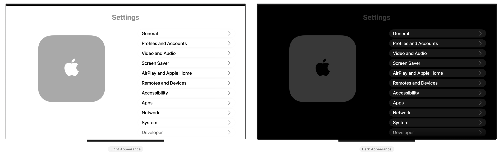

# Settings-tvOS
A **work-in-progress** recreation of the tvOS Settings app.

> [!NOTE]  
> This project is focused on the latest public releases of tvOS and Xcode. Use an older branch for older versions.

## Information
- Based on tvOS 26.2 (23K54).
- Layout based on Simulator and not a physical Apple TV (for now).
- All features within the app are only simulations and have no effect on the device outside of the app.
- Previous versions are available as their own branches, going as far back as 18.5. Fewer features are available in earlier versions.

> [!CAUTION]
> This project makes use of `TVSettingKit`, a private framework not meant for public use as it is not officially supported.
>
> **Do not reuse any code from this project that relies on private methods.** Consider publicly supported alternatives instead.

## Preview

<picture>
    <source media="(prefers-color-scheme: dark)" srcset="Assets/Dark.png">
    
</picture>

## Usage
Open in Xcode and run with either Simulator or a paired physical device running tvOS with Developer Mode enabled as a destination.

> [!IMPORTANT]  
> You may need to change the bundle identifier of the app to be able to sign it with Xcode for use on a physical device.

## Disclaimers
- This app is a personal and educational recreation of Apple's apps and designs, made in appreciation of the teams that built and maintain them.
- All assets including icons, images, localization strings, and other resources are not my own in any way.
- If you have any questions or feedback, please contact me through the options listed on my profile.

## Other Settings Projects
- **macOS System Settings** https://github.com/zhrispineda/System-Settings
- **visionOS Settings** https://github.com/zhrispineda/Settings-visionOS
- **iOS & iPadOS Settings** https://github.com/zhrispineda/Settings-iOS
- **watchOS Settings** https://github.com/zhrispineda/Settings-watchOS
